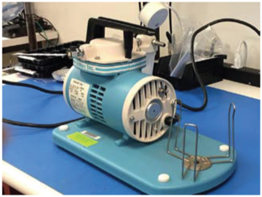

# HCL Fusion

The program fuses a visible-light picture and a an image from a thermal camera 
into a single composite image that retains both high resolution detail of
the visible image and color-coded thermal information.

### Algorithm

Fusion is performed in the 
[HCL color space](https://en.wikipedia.org/wiki/HCL_color_space)
(Hue, Chroma, Luminance). 
The visual image, converted to gray scale, is used as Luminance, and
Hue is computed from the thermal data.

### Example

Visible image

Thermal image

Composite image
